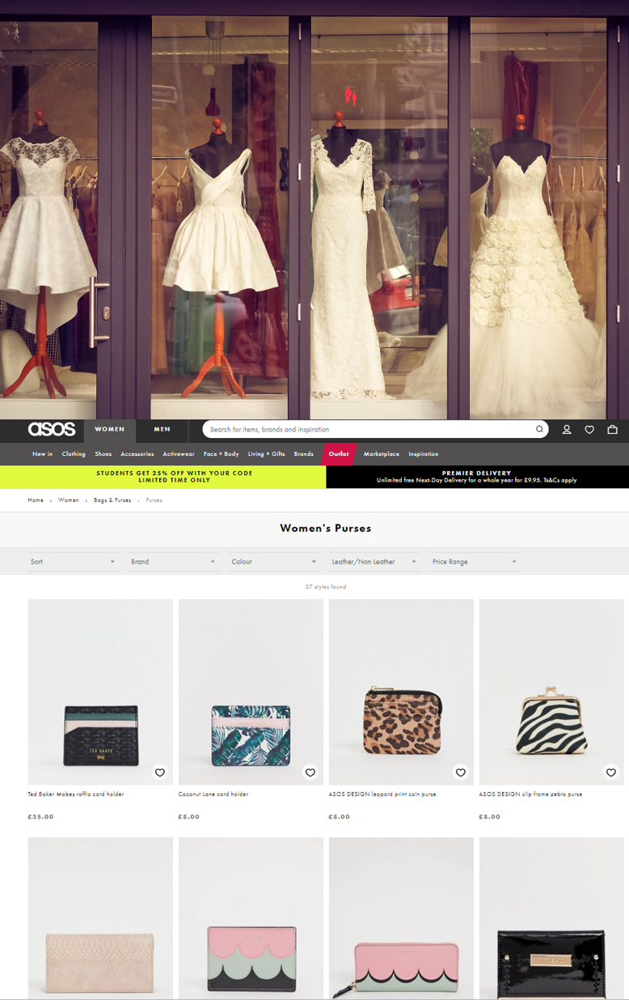
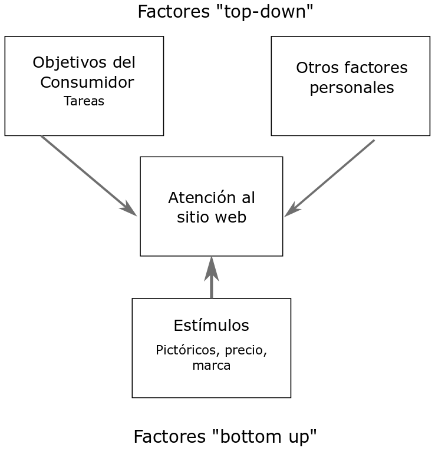

---
class: center, middle, remark-inverse 

# Introducción


---

# Atención y comercio electrónico


- 2017 Online Retailing Global: 24.8% <i class="fas fa-arrow-up"></i> y 10.2% <i class="fas fa-chart-pie"></i> de todas las ventas en el mundo.

- **Experiencia de Usuario** (UX) en los sitios de comercio electrónico tiene una importancia creciente.

- **Atención** es tanto **requisito** para la respuesta como un antecedente importante de la UX global.

- La atención del consumidor es un **recurso escaso** y el diseño del sitio debe facilitar los procesos de atención.

- **Objetivo principal**: comprender los **procesos de atención del usuario** en un determinado sitio web.
---

# Análisis de la atención al sitio web

.left-column[ 

```{r, cache=TRUE, echo=FALSE}

```
]

.right-column[

- Análisis de las "Áreas de Interés" (AOI) del sitio (Holzschlag, 1998). 

- El **área de producto** es la principal área de información de marketing y funciona de forma similar a un escaparate (Huizingh, 2000).

- La **presentación de información en esta área** es crítica para el éxito (Flavian, Gurrea and Orus 2002).

- Esta es el área que se **observa durante más tiempo** (Cortinas, Cabeza, Chocarro, Villanueva, 2019).
]

---

# La teoría de la atención a estímulos visuales de marketing 

.pull-left[

- **Factores Top-down**: aspectos del individuo (expectativas, objetivos, emociones...).

- **Factores Bottom-up**: características del estímulo visual (texto, tamaño, color, forma...) También se denominan *atmospherics*.

]

.pull-right[

```{r, cache=TRUE, echo=FALSE}

```
<small><i>Adaptado de Wedel y Pieters, 2008</i></small>
]

---

# Texto vs Imágenes

.pull-left[

## Literatura en publicidad: 

- **Ilustraciones elementos clave** en  captura de la atención independientemente de su tamaño.

- Percepción de las **imágenes** es **más rápida** y más **automática**.

- Más **atención focal** y disposición para el **procesamiento del texto**.
]

.pull-right[
## Literatura sitio web:

- Investigación **reducida**.

- Imagen  **proxy** del producto, Precio e imagen más importantes, carencia de **información sobre otros atributos sensoriales**.

- Otros factores **top-down**: etapa en el proceso de compra, implicación con el producto, sensibilidad al precio y marca....
]
---

# Objetivos

**1**.	Analizar el **efecto del estímulo**: ¿Se le presta la misma atención al precio, la imagen y la marca?

**2**.	Analizar el efecto de los **objetivos del consumidor**: ¿Cambia la atención cuando la tarea es diferente?

**3**. Analizar el efecto del **sitio**: ¿Cambia la atención cuando la categoría de producto es distinta?

**4**. Analizar la relación entre los **procesos de atención observados** y las **respuestas declaradas**: ¿en qué medida la importancia declarada de los distintos atributos se corresponde con el comportamiento de atención inconsciente?
