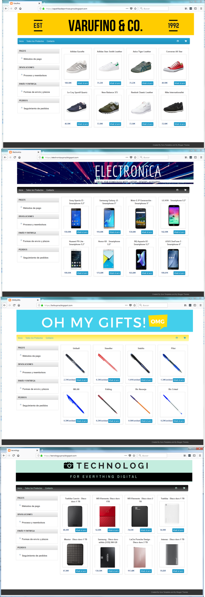
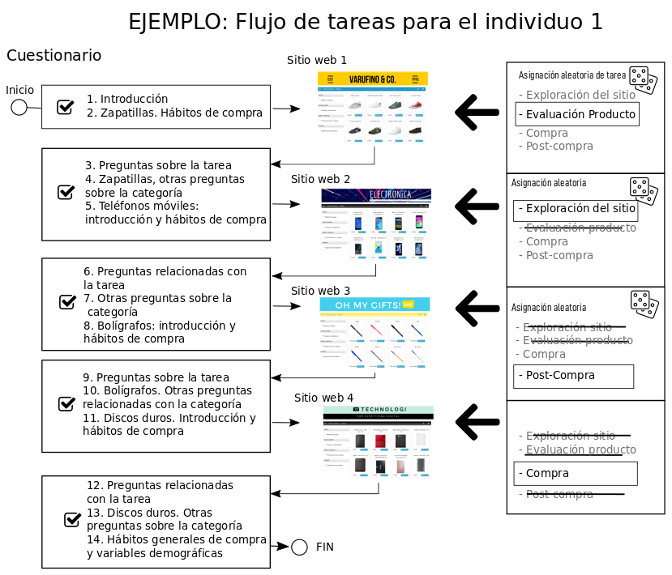

class: center, middle, remark-inverse 

# Diseño de la investigación

---

# Sujetos y Diseño

.left-column[ 

```{r, cache=TRUE, echo=FALSE}

```
]

.right-column[ 
- Cuatro **categorías**: zapatillas, smartphones, bolígrafos, discos duros.

- Cuatro **tareas**: 
  - **Exploración**: valorar el atractivo global del sitio.
  - **Evaluación de productos**: seleccionar el producto más atractivo.
  - **Compra**: localizar y añadir la opción X al carro de compra.
  - **Información post-compra**: localizar la opción de seguimiento del envío.

- **58 estudiantes universitarios**.

- Pares Tarea x Tienda asignación **aleatoria**.
]

---

# Medidas

.pull-left[

### Medidas declarativas

- **Hábitos de compra** en cada categoría.

- Evaluación **tarea**,**conocimiento**, **implicación** y **experiencia** categoría.

- Evaluación de importancia relativa de **precios, marca y servicios** en cada categoría.

- Características **sociodemográficas**.
]

.pull-right[

### Medidas del eye tracker

- Hardware: **Eye Tribe Tracker** (fiabilidad 0.5º, resolución espacial 0.1º, frame rate medio 30Hz.).

- **Calibración** antes del experimento.

- **Fijación**: posición cuasiestable (200 ms) de la mirada en una coordenada.

- Agregación de fijaciones **sujeto, tienda y AOI**.
]


---
class: center

# Experimental procedure


```{r, cache=TRUE, echo=FALSE, out.width="550px"}

```


