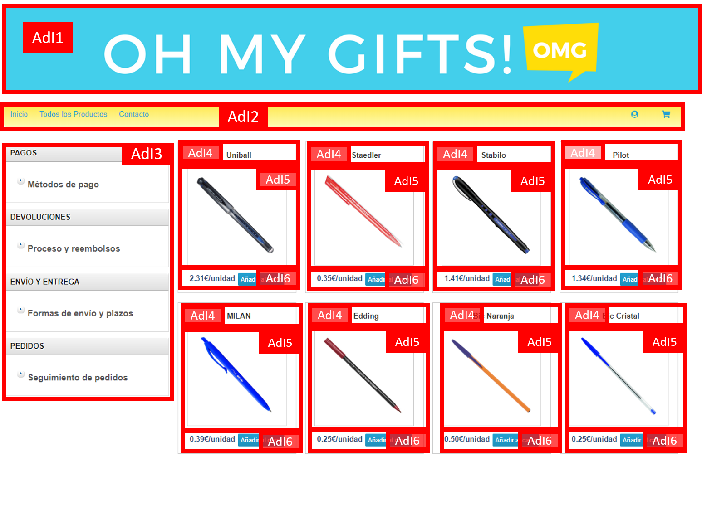
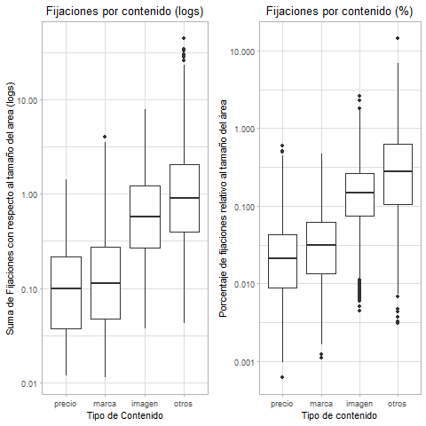
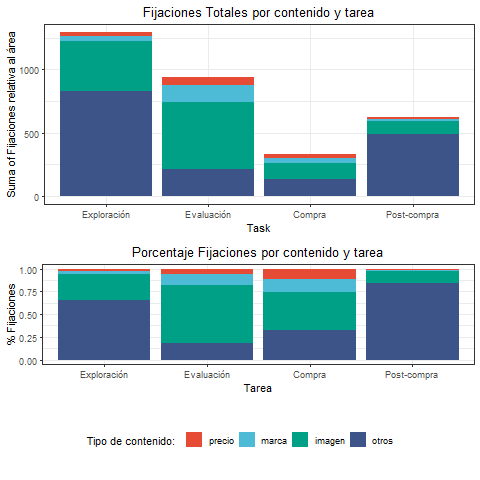
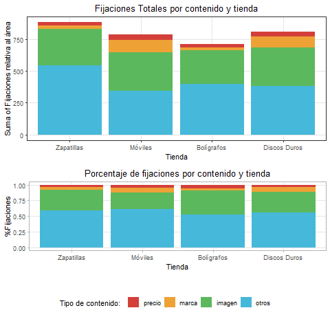
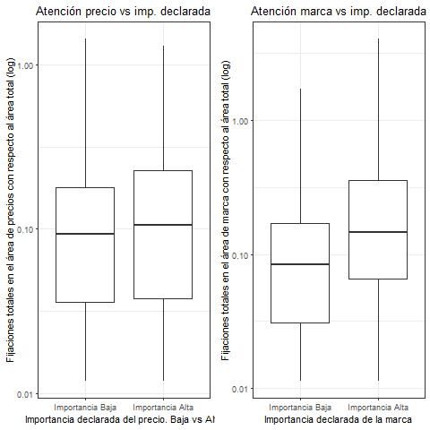

class: center, middle, remark-inverse 

# Resultados

---

# Medidas

.pull-left[

## Indicadores:

- Fijaciones en **AOI4**: **area de marca**, fijaciones en **AOI5**: **area de imagen** fijaciones en **AOI6**: **area de precios**.

- Otras fijaciones: etiqueta "Otros"  (AOI1, AOI2, AOI3).

- Estandarizamos las medidas teniendo en cuenta el **tamaño relativo** de cada área.
]

.pull-right[

## Definición de AOIs:


```{r, cache=TRUE, echo=FALSE}


```

]
---

# Intensidad de atención en cada área 


.pull-left[


```{r, cache=TRUE, echo=FALSE}

```
]

.pull-right[

- **Imagen** atrae más atención (media:0.91), seguido de **marca** (media:0.24) y finalmente **precio** (media:0.16) (Anova  F=717.8 p<0.001).

- Resultados similares si estandarizamos por **fijaciones totales del sujeto en la tarea** (Anova F=874.6 p<0.001).


]

---

# Differencias por tarea


.pull-left[
- Tareas **más complejas** requieren más atención: **exploración del sitio** y **evaluación de producto**.

- Areas de atención son diferentes, **área de producto** es más importante **en la evaluación de productos y la compra** (la opción otros es menos importante).

- En el panel inferior: **marca** y **precio** son importantes en las tareas relacionadas con la compra (**segunda y tercera tarea**).

- Las **imágenes** son importantes en todos los casos.

]

.pull-right[

```{r, cache=TRUE, echo=FALSE}

```

]

---

# Diferencias por categoría de producto

.pull-left[


```{r, cache=TRUE, echo=FALSE}

```
]

.pull-right[

- **Pequeñas diferencias** en el total de atención **entre tiendas**: zapatillas y discos duros más atención, diferencia no significativa (F=1.19).

- **Precio** más importante en  **bolígrafos**

- **Marca** más importante **teléfonos móviles y discos duros**.

- **Imagen** más importante **zapatillas** y **bolígrafos**.

]

---


# Comparación con la importancia declarada

.pull-left[

- Cuestionario: *Cuando compra online el producto X, como valora el grado de importancia de los siguientes elementos?*:
  - Precio: Muy bajo (1) - Muy alto (7)
  -	Marca: Muy bajo (1) - Muy alto (7)
  
- **Dos grupos** divididos por el valor **mediano**

- Asociación positiva marca: Sujetos con **alta importancia declarada** **pasan más tiempo** mirando esa información.
]

.pull-right[

```{r, cache=TRUE, echo=FALSE}

```

]

---
class: center, middle, remark-inverse 
# Conclusiones

---

# Conclusiones

- Estudiamos los procesos de atención a la información visual y textual considerando simultáneamente el efecto de:
  - los objetivos del cliente.
  - categoría de producto.
  - la importancia declarada de cada atributo.
  
- La **imagen** es como esperamos el estímulo **más prominente** en todos los casos.

- El papel de **marca y precio** **depende** de la tarea y la categoría.

- Las **medidas declarativas** muestran potencial utilidad en el caso de la atención a la marca, no tanto en el caso del precio. 
